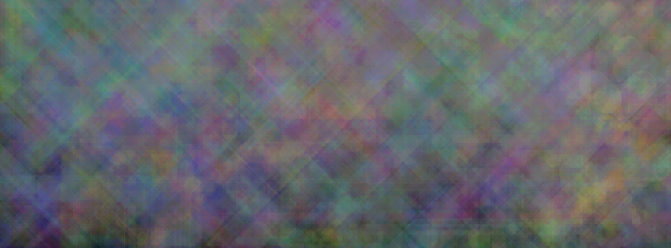
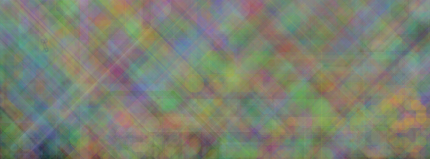
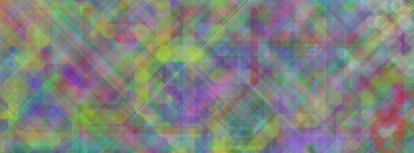
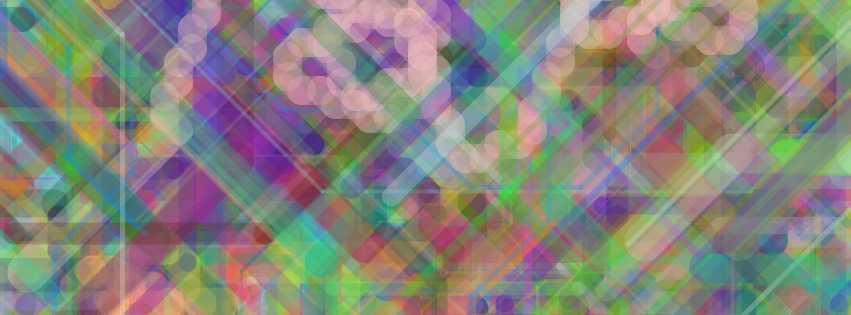
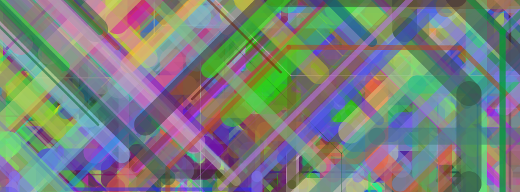
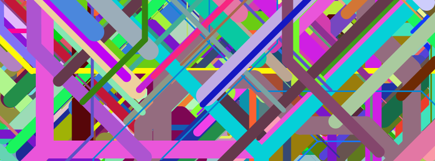

# Collatz Strokes

A graphical fun project making colorful background images utilizing the [Collatz conjecture](https://en.wikipedia.org/wiki/Collatz_conjecture).

You can make nice effects like these examples by just altering the alpha value.

